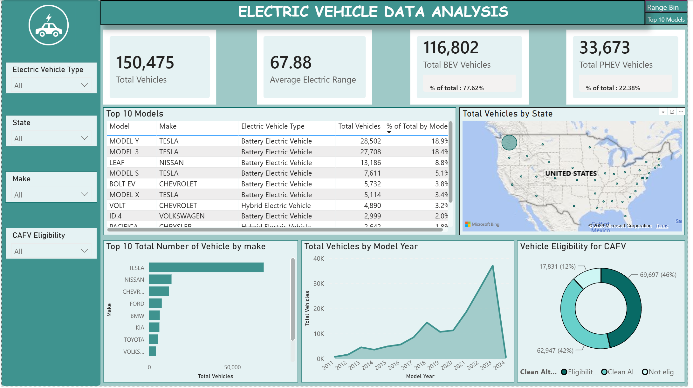
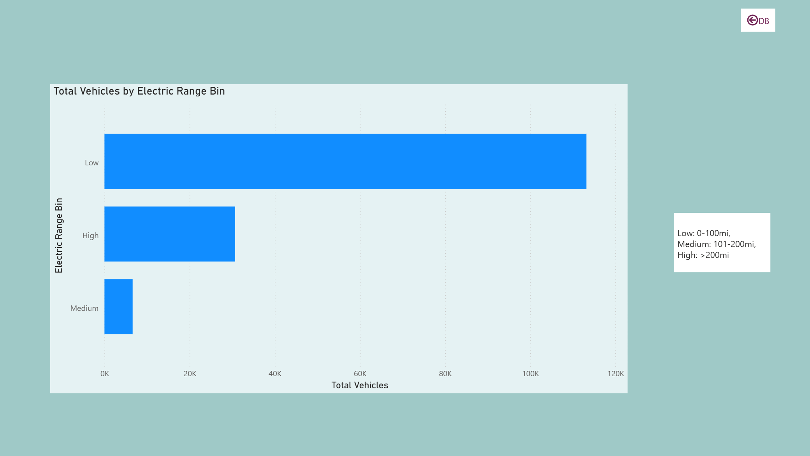

# EV Population Dashboard (Power BI)

An interactive Power BI dashboard analysing electric vehicle registrations in Washington State. The project covers the data cleaning in Power Query, the DAX measures behind each KPI, and a final dashboard with slicers and page navigation.

## Preview






## Dataset

Electric Vehicle Population Data, published by the Washington State Department of Licensing. Each row is one registered electric vehicle.

- 150,475 records after cleaning
- 14 source columns: VIN (1-10), City, State, Postal Code, Model Year, Make, Model, Electric Vehicle Type, Clean Alternative Fuel Vehicle (CAFV) Eligibility, Electric Range, Legislative District, Vehicle ID, Vehicle Location, Electric Utility
- 3 columns added during cleaning: Electric Range Bin, Latitude_location, Longitude_location

The raw CSV is not included in this repository.

## Data cleaning (Power Query)

1. **Renamed Electric Vehicle Type values:** "Battery Electric Vehicle (BEV)" became "Battery Electric Vehicle", and "Plug-in Hybrid Electric Vehicle (PHEV)" became "Hybrid Electric Vehicle".
2. **Excluded blank locations:** removed the 7 records where Vehicle Location is blank, so they are left out of every visual.
3. **Created Electric Range Bin:** Low for a range of 0 to 100, Medium for 101 to 200, and High for anything above 200.
4. **Split Vehicle Location:** the text `POINT (-122.34301 47.659185)` was split into `Latitude_location` (the first number) and `Longitude_location` (the second number), following the naming in the brief.

## KPIs and DAX measures

- Total Vehicles: 150,475
- Average Electric Range: 67.88
- Total BEV Vehicles: 116,802 (77.62% of total)
- Total PHEV Vehicles: 33,673 (22.38% of total)

```dax
Total Vehicles = COUNTROWS('Electric_Vehicle_Population_Data')

Average Electric Range = AVERAGE('Electric_Vehicle_Population_Data'[Electric Range])

Total BEV Vehicles =
CALCULATE([Total Vehicles], 'Electric_Vehicle_Population_Data'[Electric Vehicle Type] = "Battery Electric Vehicle")

Total PHEV Vehicles =
CALCULATE([Total Vehicles], 'Electric_Vehicle_Population_Data'[Electric Vehicle Type] = "Hybrid Electric Vehicle")

% of Total BEV Vehicles = DIVIDE([Total BEV Vehicles], [Total Vehicles])

% of Total PHEV Vehicles = DIVIDE([Total PHEV Vehicles], [Total Vehicles])

% of Total by Model =
DIVIDE([Total Vehicles], CALCULATE([Total Vehicles], ALL('Electric_Vehicle_Population_Data')))
```

## Report pages

Each KPI and chart was first built on its own page to show how it is calculated, then combined on a final dashboard.

**Individual pages:** Total Vehicle - KPI, Avg Range - KPI, BEV - KPI, PHEV - KPI, Model Year, Top 10 Models, Vehicle by State, Top 10 Make, CAFV.

**Dash Board:** four KPI cards, five visuals, four slicers (Electric Vehicle Type, State, Make, CAFV Eligibility) and two navigation buttons.

**Detail pages:** Range Bin Details (vehicles by Electric Range Bin) and Top 10 Models, each reached from a button on the dashboard and each with a Back button.

## Charts

- Vehicles by Model Year, from 2011 onwards (area chart)
- Vehicles by State (bubble map)
- Top 10 vehicles by Make (bar chart)
- Vehicles by CAFV Eligibility (donut chart)
- Top 10 vehicles by Model, with each model's share of the total (table)

## Key findings

- Battery electric vehicles make up 77.62% of the registered EVs, and plug-in hybrids make up 22.38%.
- Model year 2023 is the peak with 37,079 vehicles. Model year 2024 shows only 642, most likely because the snapshot covers only part of that year.
- Washington State accounts for 150,137 of the 150,475 records, so the state map is dominated by a single bubble.
- Tesla leads with 68,981 vehicles, well ahead of Nissan (13,496) and Chevrolet (12,025). Model Y (28,502) and Model 3 (27,708) are the two most registered models.
- For CAFV eligibility, 46.32% of vehicles are "eligibility unknown", 41.83% are eligible and 11.85% are not eligible.
- By electric range, 75.2% of vehicles fall in the Low bin, 20.4% in High and 4.4% in Medium.

## How to open

1. Install Power BI Desktop (Windows).
2. Download the `.pbix` file from this repository and open it.

The data is stored inside the file, so it opens without the CSV. To refresh from the source, go to Transform data, open the Source step and point it to your own copy of the CSV.

## Notes

- The brief's naming puts the first number of the location in `Latitude_location`. In the source text the first value is the longitude, so these two labels are the reverse of the usual geographic convention.
- `% of Total by Model` uses `ALL`, so it divides by the full 150,475 records and ignores slicer selections.
- The Top 10 Models table shows 11 rows because the Top N filter applies to the model name, and the KIA Niro appears as both a battery electric and a hybrid vehicle.
- A few text measures (Total PHEV Display and the two share labels) exist only to format the KPI cards.
